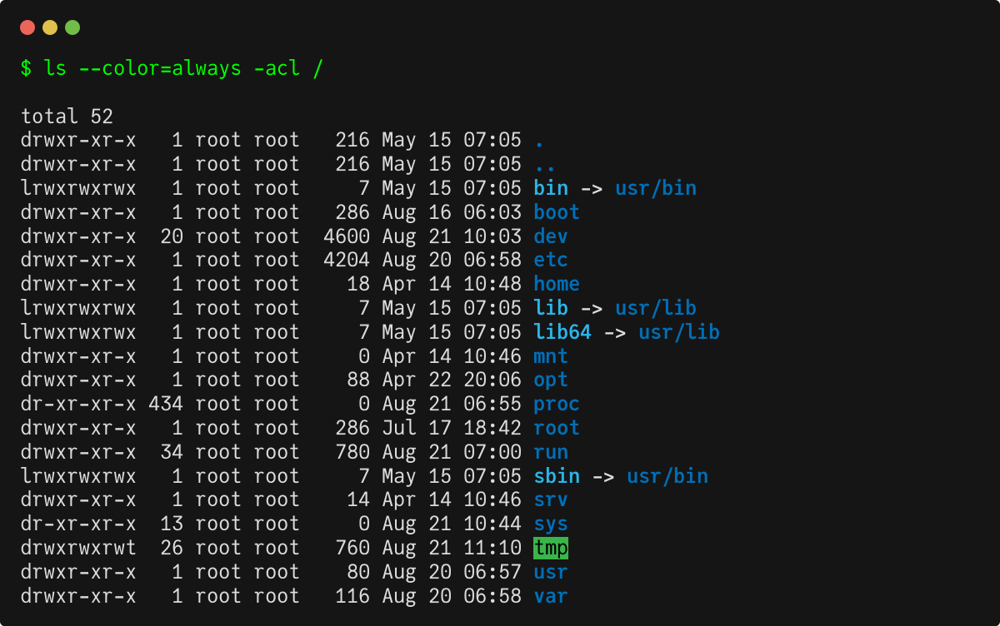

# termos 

Screenshots a terminal output.

```bash
termos shot --colums=80 -- ls --color=always -acl /
```



## Usage

Create png and txt color screenshots of the terminal command output.

```text
termos shot [shot flags] [--] command [command flags] [command arguments] [...] [flags]
```

Render png color screenshot of the file input.

```text
termos render [render flags] [--] filename
```

## Build

See [BUILD.md](BUILD.md) file.

## License

`termos` was created by Lukasz Lobocki. It is licensed under the terms of the CC0 v1.0 Universal license.

All components used retain their original licenses.

## Credits

`termos` is very heavily inspired by [homeport/termshot](https://github.com/homeport/termshot).

`termos` was created with [cookiecutter](https://cookiecutter.readthedocs.io/en/latest/) and [template](https://github.com/lukasz-lobocki/go-cookiecutter).
