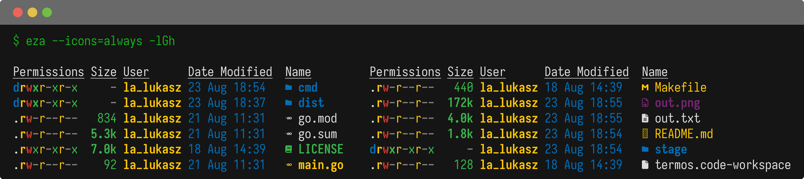

# termos 

Screenshots a terminal output.

```text
termos shot --cc=#ff4500 -- ls --color=always -acl /

Flags:
  -c, --columns int         number of columns rendered (default auto)
  -f, --filename string     name of files to be saved (default "out")
  -m, --magnification int   magnification factor (default 1)
      --tc string           titlebar color hex (default "#696969")
      --bc string           background color hex (default "#151515")
      --fc string           foreground color hex (default "#DCDCDC")
      --cc string           command color hex (default "#16AF1B")
```
Specific features:
- Julia fonts are built-in to secure broad international glyphs coverage.
- Control over colors rendered via flags.
- Reports back the number of columns actually used by the shot.

```text
╭info
╰Number of columns used: 62. Use '--columns' flag to impose it.
```



## Usage

Create *png* and *txt* color screenshots of the terminal command output.

```text
termos shot [shot flags] [--] command [command flags] [command arguments] [...] [flags]
```

After editing *txt* file, render *png* color screenshot of the file input.

```text
termos render [render flags] [--] filename
```

## Build

See [BUILD.md](cmd/BUILD.md) file.

## License

`termos` was created by Lukasz Lobocki. It is licensed under the terms of the CC0 v1.0 Universal license.

All components used retain their original licenses.

## Credits

`termos` is very heavily inspired by [homeport/termshot](https://github.com/homeport/termshot).

`termos` was created with [cookiecutter](https://cookiecutter.readthedocs.io/en/latest/) and [template](https://github.com/lukasz-lobocki/go-cookiecutter).
